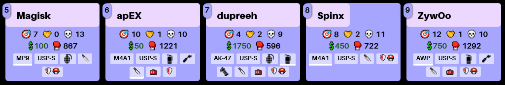

Counter-Strike is a fun game. Over lockdown, I got into the E-Sports side of things, and eventually I made an in-browser 2D replay viewer as a little personal project back in the summer of 2023. I remembered it recently and wanted to write a blogpost about it.


> Footage of the demo viewer showing a few rounds of [Into The Breach Vs Vitality on Vertigo](https://www.youtube.com/watch?v=Dtsryf3Y3js&t=20571s), played at double speed. Design wise, it's one of the ugliest websites I've made, but as a prototype I'm happy with it.

## Preamble: What's Counter-Strike?

*Counter Strike* was originally released in 1998 as a Half-Life mod. The latest version of it, *Counter-Strike 2* (which, surprisingly, is the fifth CS game), was released in 2023, and it's now the most played game on Steam. Most days, there's a point during the day where about [1.4 million people are playing it at the same time](https://steamcharts.com/app/730).

If you don't know anything about CS, the basic rules of the game are:

- There are two teams, each with 5 players: the T side and the CT side
- Each round, the T side wants to get to one of the two bombsites and plant the bomb within the time limit (about 2 minutes). Once the bomb is planted, it takes 40 seconds until the bomb explodes. T's want the bomb to explode.
- CT side wants to stop the T's from planting the bomb, or to diffuse the bomb once its planted
<!-- more -->
- If the bomb explodes, then the T side wins the round. If the bomb gets diffused, or isn't planted within the round time limit, then it goes to the CT side
- Players have guns and can shoot each other. If you die, you're out for the rest of that round, but you come back for the next one.
- If either team eliminates all the players from the other team then the remaining team win
- First to 13 rounds wins, and the teams switch sides halfway through

There's a lot of other stuff going on too, like utility grenades, money, different gun stats, etc but this is the basic gist of it.

What's interesting about the high-level play to the game is the general positioning and team play that goes into each round. T's have the option of going to the A bombsite or the B bombsite, and the CT's don't know which site is the one the T's are going to. This leads to a lot of tactics about where to position yourself when playing, and what information you can gather about the positioning of the other team.

In CS, shooting guns at other players is important, but its a lot more important to gather information about the other team, but also obscure any info about your own. 

High level gameplay involves T's "faking" bombsite hits (like throwing flashbangs/smokes at A, in order to lure the CT side to rush over, only to then run into an empty B site), or to hide in key chokepoints if you can predict where other players are to pass through, or to throw grenades at certain spots at certain times in order to disperse/confuse/damage other players who thought they were hidden.

On the surface its a shooting game, but really its a complex chess game of knowing where to position your team, and finding out where the other team is. It's hide and seek on steroids.

At the pro level, teams will watch other team's matches in order to figure out their play style, like how chess players research their opponents' favourite openings. Do teams like to hide out near a bombsite and enter quickly, or do they spread out and try and prod for weaknesses? Do they have areas of the map that they neglect? Do they have predictable set ups that can be exploited?


<iframe width="560" height="315" src="https://www.youtube.com/embed/k4L4zTZ4tZI?si=qMRevRG5-iBnhDRE" title="YouTube video player" frameborder="0" allow="accelerometer; autoplay; clipboard-write; encrypted-media; gyroscope; picture-in-picture; web-share" referrerpolicy="strict-origin-when-cross-origin" allowfullscreen></iframe>


> A segment from Blast.tv's "Mahone Zone" series showing how much analysis goes into these games

## The Demo Viewer

After each game, you can download a Demo file - this is a complete replay of the entire game. You can view this in Counter-Strike itself, but its a bit heavy handed. The tools involved are pain to use and it requires booting up the game, and skipping through timeouts and buy-times and other things. Its good for viewing individual players viewpoints, but not great at observing team play as a whole.

This led me to make a tool that lets you rewatch demos in a quick and easy way. It's a website that shows a 2D top down replay of games, showing the locations of all the players and how they move around the map.

## How it works

It uses [DemoInfoCS](https://github.com/markus-wa/demoinfocs-golang/) to parse the demo files in order to read the actual content - I weighed up a few different options for this but in the end this felt like the best implementation, and I didn't want to get bogged down with working out the way the data inside the demo file is actually formatted.

The parser library is written in [Go](https://en.wikipedia.org/wiki/Go_(programming_language)) - this is the first time I've ever worked with Go, and there was a bit of a learning curve, but I like learning new programming languages so I was fine with this. I found out you can compile Go to WASM in order to use it in the browser, so I got that set up and running and was surprised to find out it was actually pretty painless. An earlier version of this project was using C#, a language I'm very comfortable with, but the parser library I was using wasn't exactly what I needed, so I ended up porting it over to use the Go library.

Outside of the parser and my extensions to it, everything is just vanilla javascript, HTML and CSS. I considered using Typescript, which I've used for other websites, but decided against it as all of main logic is written in Go anyway. I could probably upgrade to TS later but seeing as it would largely just be to call Go functions and wrap Go objects, I decided to not worry about it.

### Templating / DOM manipulation using Riot.js

For the rendering, I'm using [Riot.js](https://riot.js.org/). I mainly just wanted a quick way of templating how an individual gameplay object (like a player, or smoke grenade, or statistic, etc) should be displayed (eg. a SVG element, or a PNG, or a div), and the ability to show/hide/modify it without getting my hands messy touching the DOM directly. 

---

#### Aside: how does Riot.js work?

Riot lets you define custom *tags* for elements that need to be dynamic. For example, for listing out the players' equipment, you can define a `<equipment>` *tag* like this:

```html
riot.tag('equipment', `
<div class="equipment">
    <div class="equipmentitem {type} {isActive}" each={opts.items}>
        <span if={showText}>{name}</span>
        </img>
    </div>
</div>`)
```

This tag roughly says:

- For each item in `opts.items`, create a `<div>`, with the div's class list containing the values of `item.type` and `item.isActive`
  
  - If `item.showText` is true, then add a `<span>` containing `item.name` to the div
  
  - If `item.imgSrc` exists, then create a `` with that as the source

Once the tag is defined, you can use it elsewhere, even in different tag definition - for example, a `<playerscoreboard>` riot tag:

```html
riot.tag('playerscoreboard',  `
<li each="{opts.players}" class="playerinfoli">
    <div class="playercard {classes}">
        <div class="topbar">
            <div class="healthbarcontainer">
                <div class="health" style="width:{health}%"></div>
            </div>
            <span class="index">{index}</span>
            <span class="playername">{name}</span>
        </div>
        <div class="playerinfodiv {classes}">
            <div class="playerstats">
                <div class="inf playerstat">
                    <span>?�� {kills}</span>
                    <span>?�? {assists}</span>
                    <span>?�� {deaths}</span>
                </div>
                <div class="inf playerstat">
                    <span class="cash">?��{money}</span>
                    <span>?�? {totaldamage}</span>
                </div>
            </div>
            <!-- Like here: --> 
            <equipment items={equipment}></equipment>
        </div>
    </div>
</li>`);
```

When you actually want to place a custom tag in "real" html, you just use it like any other html tag, specifying the object data via a JS call:

```html
<playerscoreboard players="{tPlayers()}"></playerscoreboard>
```

This creates an instance of the playerscoreboard tag we've just defined, and specifies the `opts.players` value to be whatever `tPlayers()` returns. 

And that's pretty much it. Riot.js does the heavy lifting of updating the actual DOM whenever javascript objects update. I still manually have to tell riot to update - it doesn't have any magic value-changed hooks, but for this case it's fine, as I have to update the page at a set framerate anyway.

The end result of `<playerscoreboard>`, with some CSS, is this:



The healthbar container is at the top, the player stats are in the center (the numbers paired with emojis), and the white boxes with text/icons is the equipment. The equipment items with the white underline are ones that have `isActive` = true (ie. the player is holding it). As a side note: with hindsight I have no idea what I was thinking with this colour palette choice.

----

All moving parts of the UI are written using Riot - every player icon, every grenade, the leaderboard, player stats, the killfeed, etc. It's my first time using Riot and I really like it - very easy to set up, and its very unintrusive to the rest of the code. I just want to move and update some divs, so something lightweight and focused like Riot.js is perfect - I'll definitely be using it for other projects.

The file reading part of the project is pretty straightforward, so I won't write much about it. You give the parser a demo file, and it reads the headers (eg. the players, the team names, etc). You then continuously tell it to advance a tick (1/64th of a second), and it tells you all the events that happened that tick: for example, player 3 shot their weapon, player 6 took some damage, smoke grenade 21 extinguished at position XYZ, etc etc. The viewer then just keeps track of these events and feeds the useful info over to Riot to update the UI.

## Problems

The demo viewer itself is basically feature-complete, but there are problems with it as a whole, which is why it isn't 'released' yet:

- **Go WASM builds are huge**
  
  - The demo parser and replay logic code isn't very big, but the resultant WASM is over 20mb. This seems to be a problem with Go itself, and I'm not sure how to go about fixing this. There's a project called [tinygo](https://tinygo.org/), which alledgedly is meant to fix this and create smaller WASMs by cutting out a lot of the Golang bloat that gets compiled in, but I can't get it to work correctly - it doesn't build the library I'm using to parse the demo, because (I think?) the parser is relies on one or more of the parts tinygo removes.

- **The parser isn't designed to support jumping ahead/behind.**
  
    - Internally, the demo files are made up as a big list of individual events - like "player X just died", or "a smoke grenade just landed here" or "round 6 just ended", but they don't contain full state objects - you have to keep track of all these events and build up the state by yourself. This means jumping to a particular time mid-round doesn't give you a full picture - if you jump to a random time mid-game without parsing all the events that happened before it, you are missing information. The demo could continue and you'd reach an event that says "smoke grenade 5 just despawned", but you didn't have any record of smoke grenade 5 ever being thrown. You could solve this by parsing the whole file and storing it in a time-based database, but these demo files are huge (60-150mb - storing 64 events a second for a game can that last up to an hour) and parsing all of that at once would be slow and memory intensive, especially when browser-based.

    - I've hacked in my own rewind features, but it isn't perfect at all, because the parser is designed to just go from start to finish and visit each event once.

    - A naïve rewind can create issues - for example if you want to rewatch the end of a round, it could confuse the score board. The parser would increment the scoreboard multiple times

    - I've sort-of got around this by just fast-forwarding rather than jumping ahead, and by "bookmarking" states but its a bit hacky, slow and buggy

- **The file format isn't stable**
    - Counter-Strike 2, the latest CS game, was very early in release when I made this, and they kept slightly tweaking the file format for demo files after release. I didn't want to play cat-and-mouse and deal with teething issues, especially as I'm using a open source parser maintained by someone else

Its a nice project and I might pick it up again if I can find a suitable way of rewinding and if I can get the page load under 5mb.