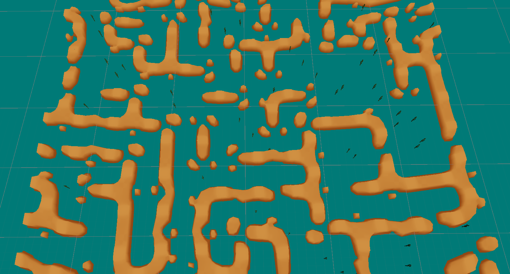
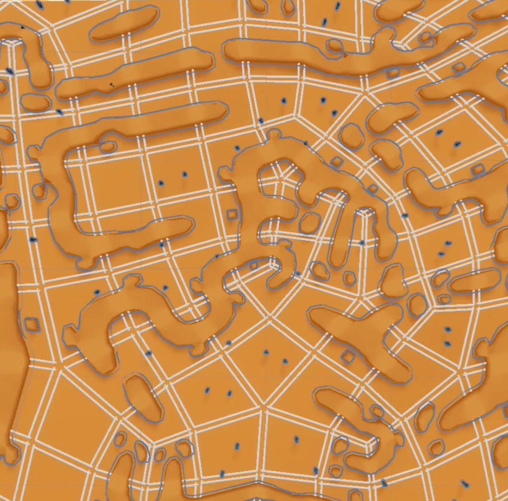
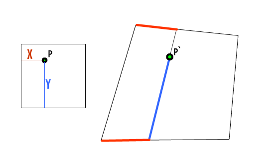

In the last couple of months I've been working on a implementation of the Wave Function Collapse algorithm, which is for creating large patterns out of a selection of smaller tiles that can fit together. It's kind of like playing [the board game Carcassone](https://www.google.com/search?q=carcassonne+game&tbm=isch), where there's a grid of potential places a tile can go, and deciding whether the tile can sit in that position is based on whether the edges of that tile match the neighbouring edges. If you haven't played it before, it looks like this:


The WFC algorithm very similar to just playing a round of Carcassone by yourself, but with a bit more forward planning about where you put your next tile. The basic gist is:

- You put a tile down in a legal spot
- For each of the four neighbouring spots, you work out a list of all the possible tiles that could fit there
- You then do that again for all the neighbours' neighbours, calculating which tiles could legally go there
- Once you've worked out all the potential different tiles for each spot in the grid, you pick the spot with the _shortest list of potential tiles_
  - So if there's a spot that can only accept _one specific type of tile_, you'll end up picking that one
- You then place a legal tile in that spot, and repeat the whole process over again with the remaining empty spots

You keep doing this until the entire area is filled up (or you get a spot that can't be filled because it requires a type of tile that doesn't exist - but if you have a decent variety of tiles then this shouldn't happen often).

This algorithm isn't simple, but it isn't too difficult either - you just need to maintain lot of lists that specify what tiles are legally allowed in each position.

Here's my version running on a regular square grid, using a basic set of "desert rock" tiles:



End result (with the background removed so it's easier to see):

<!--- more -->



It works well, but it's a bit boring. From looking at the end result, it's pretty obvious it was made using a grid based method, as there's a lot of straight lines and right angles. Rocks that are very far apart run parallel to one another, which isn't something that would happen in nature. Reuse of tiles is quite obvious when you look a bit closer. Everything is the exact same size. It's a fine system if you want to block out an office layout, but it doesn't really look that natural.


## Non Square Grids

The cool thing about the WFC algorithm is that it doesn't actually require a regular square grid to run. All the "grid" needs to do is list a bunch of cells, and to dictate what cells neighbour each other. So instead of doing using a boring regular square grid, we can use something like this:



Here, every cell still has 4 edges, each of which can be shared by exactly one other cell - these are the only requirements for a grid for our version of WFC. It might look a bit weird, but (in theory) it works just as well as a regular grid.

With this grid we see some cooler patterns, like:
- Rows of cells that gently curve
- Points where 3 or 5 cells meet at a corner (rather than only ever 4 meeting in the regular grid)
- Variation in size and shape of the cells

But it also raises some questions:

- How do you even generate a grid like this in the first place?
- How do you get around the fact cells can't have an (x,y) coordinate any more? And neighbours aren't axis-aligned?
- How do you squash a square tile into a non-square cell?
- Why are you doing this, you utter mad man?

Each of these questions caused me a lot of pain.

I'll keep the answers brief to not bring up too much suffering:

## How do you even generate a grid like this in the first place?

The algorithm for making a grid like this was originally thought up by [Oskar Stalberg](https://twitter.com/OskSta/status/1147778221058023424) (who, by the way, is an absolute genius and I wouldn't have gotten half of this done without his extensive posting on the topic). You basically create a bunch of triangles, and merge some of them together - this creates a mixture of triangles and quads. If you then subdivide everything, you get a bunch of quads that fit our requirements. You can then run a relaxation algorithm on all these points to smooth it out a bit. 

[This gif by Oskar](https://twitter.com/OskSta/status/1147881669350891521) demos the process very well.

## How do you get around the fact cells can't have an (x,y) coordinate any more? And neighbours aren't axis-aligned?

Yeah that was a pain. 

With a square grid, you can label each cell with an `x` and `y` position, which is handy. You can also work out neighbouring cells really easily, because to get the cell to the north, you just add 1 to the `y` position, or for the west you just subtract one from the `x`.

But with an irregular grid you can't, because concepts like "north neighbour" and "cell position" don't mean anything any more. You can't give any cells a meaningful `x` and `y` coordinate.

There's not a good mathematical shortcut here for getting around this stuff, because this grid is disorganised _by design_. The only way is to just have a good object model and manually keep track of what vertices and edges are shared between cells.


## How do you squash a tile into a non-square cell?

The problem is that we now have square tiles, but we want to fit them into non-square cells, and we still want to line everything up so all the edges fit nicely together.

This is basically like skewing an image.
We've got some stuff in a square here, and we want to put it in some arbitrary quad over there, but we want the contents to translate in a way that makes visual sense. All we need is a way of translating individual points from one to the other.

The method I ended up with was using lerps and inverse lerps. Assuming a normalised `(0,0)` to `(1,1)` set of coordinates in the base module, we can do something like this, where we want to translate point `P=(X,Y)` to the point `P'` inside the quad `ABCD`:



where:
``` c
Q = Vector3.Lerp(A, B, X);
R = Vector3.Lerp(D, C, X);
P` = Vector3.Lerp(R, Q, Y);
```

Here, we're using lerps to figure out where in this new quad the point should sit. This works for pixels on bitmaps, or vertices on meshes, and it's the basic idea behind how it squashes the mesh into the irregular cell. 

This method doesn't work if the quad is concave, but if that's happened you're screwed already.


There's a lot more I could talk about but this post is already far too long! Hopefully it was interesting! If you want to ask any questions about it I've got a [twitter thread](https://twitter.com/zappablamma/status/1546919431107911680) going - feel free to reply there :)

Finally, here's a quick clip of the algorithm running on an irregular grid (also shows the grid generation and some very early gameplay footage).

