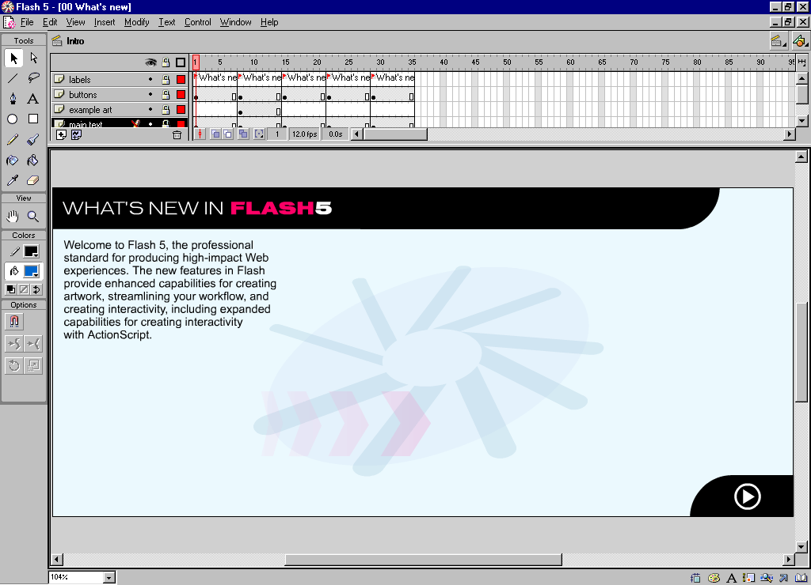
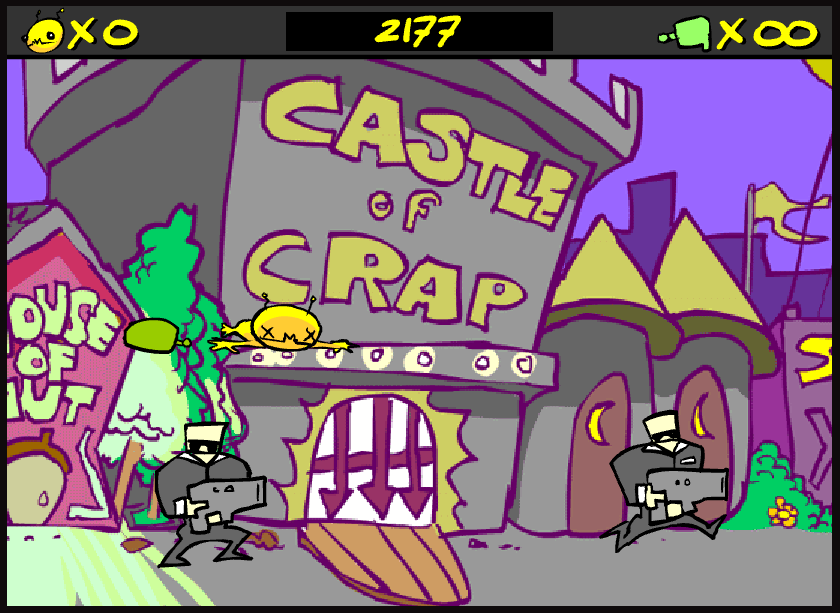

With the news that [Windosill](https://vectorpark.itch.io/windosill) is [going to be released for the Nintendo Switch](https://twitter.com/vectorpark/status/1588577343865774080) I wanted to write a bit about Vector Park and how much their work affected me artistically and educationally growing up.

## Background - Early Flash

A bit of back story: back in 2004 I was 11 years old. The company my dad worked for had gone bust and laid everyone off, and he had stolen a bunch of office supplies on his last day. Me, my brother and sister were given company branded pencils for school and had fights with company branded stress balls. We had branded mouse mats and erasers and a couple of mugs.

Even at this point I had been showing signs of being a weird computer kid, so for me the best thing he stole was a CD copy of Macromedia Flash 5.

Macromedia Flash 5 (who's future versions would become Adobe Flash in a few years) was a perfect IDE for an 11 year old. If you've never made anything with early versions of Flash before, the basic premise (as my 11 year old brain understood it) was this:

- You're making a flipbook, and you can add as many pages as you want
- You can make movieclips, buttons and "graphics", which were like special-purpose self-contained flipbooks that you could put in your "main" flipbook
- You can add scripts to on-screen objects (or frames themselves) to get something to happen (like jumping to a different frame, or moving something on screen)

And thats about it. 

<!-- more -->

The scripts were written in ActionScript 1.0, which was new in Flash 5. In my tiny child mind there were only a handful of "actually important" concepts in AS1 - functions like `gotoAndPlay()` to manipulate the flipbooks, properties like `_x`, `_y` and `_rotation` to move stuff around on screen, the do-all `on()` function to get user input, `hitTest()` for collision detection, and a short list of other functions.

With just these concepts you could do a huge number of things, as long as you could mentally frame them in this 2D flipbook based system.

For example, for a platformer, you could have your player be a movieclip with several running-animation frames, and some idle animation frames. You could then position it correctly using `_x` and `_y`, and use some `gotoAndPlay()` calls to make sure the player flipbook was playing correctly as they ran about, and then another `gotoAndPlay()` to show the idling animation. 

With this flipbook-based system you could remake Pacman or Mario. You could make a point-and-click adventure, or a tower defence game, or basically any game as long as:

- It was 2D
- Animations were pre-drawn and stored in these flipbooks

Flash, as a game engine, gave you very little in way of features compared to modern day software like Unity or Godot - but at it's core the intuitiveness of the 'flipbooks-with-scripts' system was the reason it was so wildly successful at getting teenage weirdos like myself into game development. 

The downside is that this flipbook system had an artistic footprint. It was the game-development equivalent of the South Park animation style. You can see the visual repercussions of this framework of game development in practically all flash games - in QWOP, Bloons, Madness Interactive, Alien Hominid, or countless others.

_[Alien Hominid](https://www.newgrounds.com/portal/view/59593) By Tom Fulp and Dan Paladin released 2002._

I say "practically all" because there is a massive exception to this rule: Vector Park.

# Vector Park and egg.swf

egg.swf is a game made by Patrick Smith in 2003 under the name Vector Park. It is a 5 minute long interactive animation following an egg that transforms into different creatures and objects that follow your cursor. I have no idea if "egg.swf" is the name the author uses (it was presented wordlessly on vectorpark.com) but it's the name I've been using since I saved it onto the family computer in about 2006.

I cannot describe how many thousands of hours I have spent thinking about egg.swf. Every now and then, when I cannot sleep, I think about egg.swf in order to drift off. I have been thinking about egg.swf for nearly 17 years.



> You can download the actual swf file from the internet archive [here](https://web.archive.org/web/20031003090810oe_/http://vectorpark.com/films/egg.swf), but you might not be able to play it without having the Flash player installed on your PC somewhere. Unfortunately, Ruffle.js doesn't play egg.swf correctly, and Vector Park haven't rereleased egg.swf as a standalone game after Adobe killed Flash.
> [You can however watch this full play through I uploaded to Youtube](https://www.youtube.com/watch?v=WMiLNKnlsRY)

Being a relatively-inexperienced Flash 5 developer and seeing egg.swf for the first time felt like finding a painting that could talk. It felt like entering a woodworking competition and finding out that one of the other competitors had successfully made a living cat. It felt like meeting someone at a party who claimed they could eat a car whole, and then seeing them do it.

Flash, in my eyes, was just a powerful version of PowerPoint. egg.swf by Vector Park clearly could not have been made in Flash.

egg.swf is a tour de force of things that any self respecting kirupa.com forums user would have told you were _impossible to do in Flash_.

If, in 2003, you Googled "how to do 3D in Flash", you would have got zero useful results. It was like asking how do you make a car drive upwards - if you want to do it, you need to sort the details out yourself, and it probably won't work very well.



But in egg.swf, it all works seamlessly. Not only is there 3D, there's 3D softbody simulations, 3D inverse kinematics, there's shadows, there's 3D curves, there's 3D objects that seamlessly blend into other 3D objects. There's 3D physics and abstract walk cycles and everything has this believable, wonderful _weight_ to it.

Even ignoring it's technical prowess, it's also a hugely impressive piece of interactive art. Every single frame of it is well balanced, beautifully coloured and exudes this peaceful and curious quality. It's calm, funny, playful and weird, and does all of this purposefully and flawlessly.

This is especially notable at the time, as Flash games in 2003 were, for better or for worse, were being dominated by edgy teenagers. Newgrounds was in the early stages of it's hayday, having created it's automated self-publishing Flash portal only 3 years prior, and a lot of its content at that time had a [signature](https://www.newgrounds.com/portal/view/310349) [edgy](https://www.newgrounds.com/portal/view/71851) [vibe](https://www.newgrounds.com/portal/view/66940). This wave of outsider art was groundbreaking in it's own right, but something that hasn't aged very well, which contrasts heavily with Vector Park.

Seeing egg.swf and knowing it was made in Flash, despite the fact it obviously could not have been made in Flash, was a turning point for me. With other Flash games I could see how they were done. They felt like they had the same tools as me - even if their skill outweighed my own, I could reckon on the basic implementation of most flash games. But with egg.swf that was impossible.



One of the interesting things about Vector Park and the early 2000's internet in general is that it was a closed book. There weren't DM's or likes or replies or comments. At the time, [www.vectorpark.com](https://web.archive.org/web/20030405150431/http://www.vectorpark.com/) didn't have a blog or an email address or even a human name on the page - The only piece of text was "This site requires the latest Flash plug-in", with the rest of the navigation done via images. There was no information at all about how it was made, or even who made it. The only thing that could help you understand how it was made was simply the evidence that it _was_ made.

Knowing that something like egg.swf could be made in Flash 5 made 13 year old me really think about programming, maths, and design in general. Yes, obviously the 3D was a trick somehow - but how? The complete lack of info was what made it interesting. 

So I learned about the drawing API for Flash (which lets you draw 2D shapes and lines programmatically at runtime, instead of in the editor), assuming that was the basis for Vector Park's rendering technique. I tried to make my own fake-3D system using 1 point perspective and some questionable mathematics. I made an ok-ish IK system, which turned into a decent rope simulation, which turned into a surprisingly nice soft-body physics sim. I taught myself trigonometry and vectors and hacked them all together completely incorrectly trying to figure out how egg.swf worked. It gave my brain an insatiable itch that I still to this day haven't fully scratched. This urge lead me down the path were am I today - weird computer kid making video games.

I still don't know how Vector Park made egg.swf, and I don't know if I ever will - to my knowledge he hasn't ever delved into the nitty gritty implementation details of it publicly. Vector Park's games have only got visually more impressive and larger in scope - culminating with [Windosill](https://vectorpark.itch.io/windosill) and [Metamorphabet](https://vectorpark.itch.io/metamorphabet) - with the core of them still are built off the same system, but for me seeing egg.swf was the turning point from just a kid with access to Flash 5 to someone who had a lifelong urge to make visual playthings.



----

Go check out Vector Park on [itch.io](https://vectorpark.itch.io) and on [Twitter](https://twitter.com/vectorpark/), and make sure you get [Windosill](https://vectorpark.itch.io/windosill) for Switch when it comes out on the 11th!!